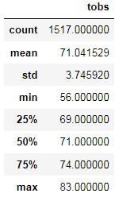
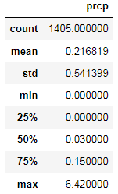

# Surfs_up
## Overview
The goal of this analysis is to look at various weather data in the months of June and December to determine if opening a surf and ice cream shop in Oahu, Hawaii is a smart investment. This analisys will look at temperature data during those two months and compare and contrast them.
## Results
- The mean temperature in June is 74.9 degrees and in December 71 degrees. With only a 4 degree difference (rounded up) the mean temperature does not look to be a big deterrant in how the business will operate in the winter.
- The same can be said about the maximum high in June and December with 85 degrees and 83 degrees respectively.
- However the lows is where pause can be given. In December the low is 56 degrees.

## Summary
Overall, I would say there isn't a big risk in operating the shop in the month of December based on this preliminary analysis. The average temperatures and the highs are very similar depsite being in different season. This could lead to steady business at virtually all times of the year due to the islands climate. Additional analysis was made on precipitation which follows.
- The mean of precipipitation in June is 0.13 and December is .21
- The minimum for both months is 0 and the max for June is 4.43 and in December is 6.42.
Once again the differences are minor. Further analysis would need to be done on humidity levels, wind speeds, and water temperatures. These variables can be a factor in how the temperature feels outside which will give a clearer picture on the viability of the store in December. Another analysis, although not weather related, could be on the surf of the ocean. If seas are rough in a given month it could mean that people would not go to the beach at the time.

